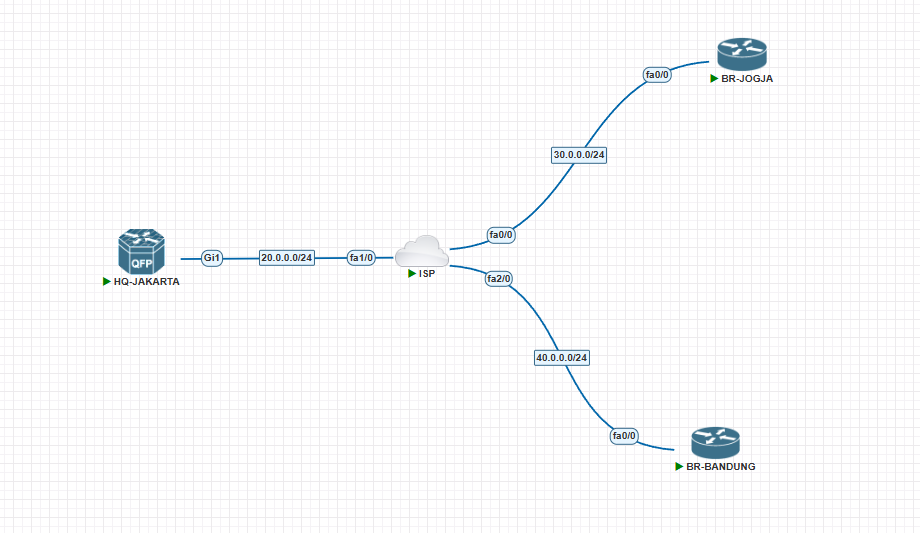

# Topologi DMVPN (PNETLab)

Berikut adalah topologi jaringan yang digunakan dalam simulasi DMVPN:

## Image yang digunakan:

- **HQ-JAKARTA** : `csr1000vng-universalk9.17.03.05-serial.tgz`
- **BR-BANDUNG**, **ISP**, **BR-JOGJA** : `c7200-adventerprisek9-mz.152-4.S6.image`
